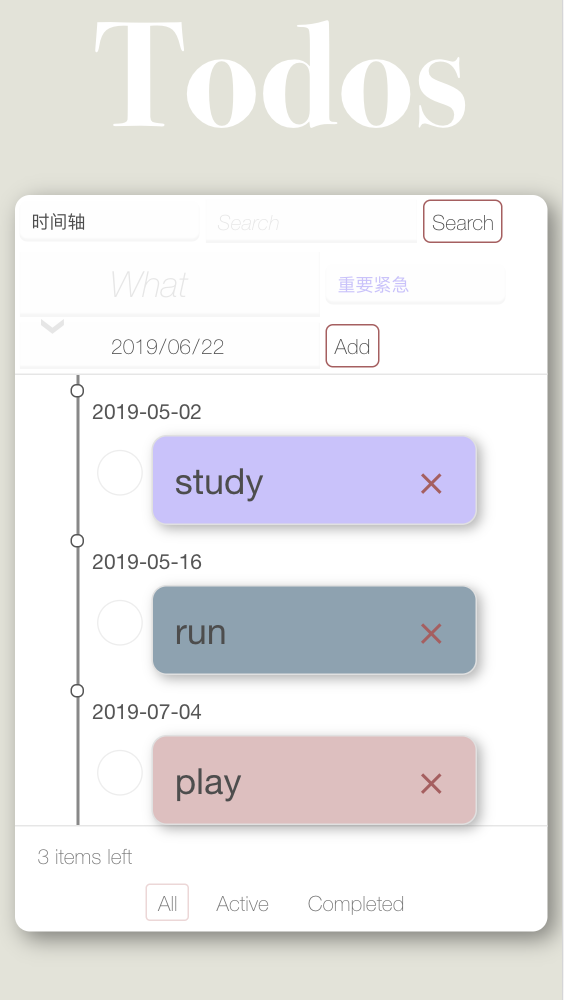
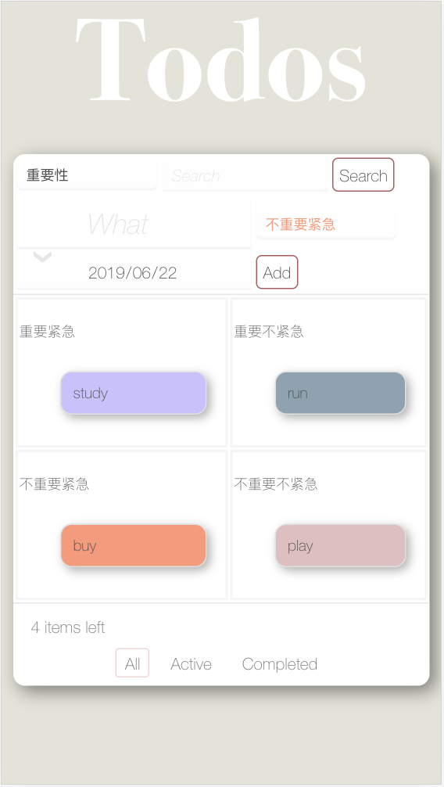
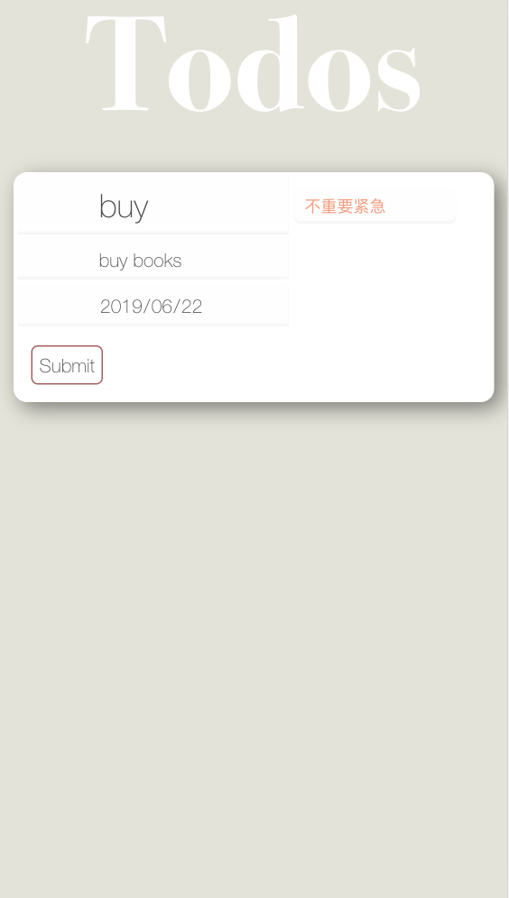

# TodoMVC

## 1. 项目概述

手机版TodoMVC，可以管理每日待办事项，采用localStorage存储数据。根据时间或类型优先级排序，且通过不同主题颜色识别这些任务事项。

## 2. 功能介绍

### 2.1 卡片式布局



每个Todo事务采用卡片形式，信息模块化，使信息表达更清楚明确。可以实现新增、删除、展现列表、全部完成/取消、删除已完成等基本操作。

### 2.2 时间轴

新增事务时必须选择日期，默认采用时间轴方式查看事务，也可以用户选择按类别查看。时间轴方式更直观地看出各项事务的时间安排。时间较近的排列在前面，时间较后的排列在后面。

在代码中采用了插入排序算法，即每步将一个待排序的记录，按其时间的先后插入前面已经排序的文件中适当位置上，直到全部插入完为止。

```javascript
        var i;
        var itemflag = 0;
        // Sort by time
        for(i = 0; i < recorditem.length - 1;){
          if(itemData.year > recorditem[i].year){
            i++;
          }
          else if(itemData.year == recorditem[i].year){
            if(itemData.month > recorditem[i].month){
              i++;
            }
            else if(itemData.month == recorditem[i].month){
              if(itemData.day > recorditem[i].day){
                i++;
              }
              else{
                list.insertBefore(item, list.children[i]);
                itemflag = 1;
                break;
              }
            }
            else{
              list.insertBefore(item, list.children[i]);
              itemflag = 1;
              break;
            }
          }
          else{
            list.insertBefore(item, list.children[i]);
            itemflag = 1;
            break;
          }
        }
        if(itemflag == 0){
          list.insertBefore(item, list.children[i]);
        }
```

### 2.3 事务类型

新增事件时用户需要选择其类型，根据四象限法则管理日程，把事务分为重要紧急、重要不紧急、不重要紧急、不重要不紧急四类，不同类型的事务卡片颜色不同。并且建议用户的策略是：

马上做：如果你总是有紧急又重要的事情要做，说明你在时间管理上存在问题，设法减少。

计划做：尽可能地把时间花在重要但不紧急（第二象限）的事情上，这样才能减少第一象限的工作量。

授权做：对于紧急但不重要的事情的处理原则是授权，让别人去做。

减少做：不重要也不紧急的事情尽量少做。



### 2.4 显示方式

用户可以自由选择采用时间轴方式或者四象限方式查看事务，默认是采用时间轴方式。

### 2.5 单条编辑

用户长按某个事务卡片，可以进入该条的编辑状态，可以修改事务名称、类型、日期、添加详细描述等。



实现长按：

```javascript
var longPress = function (dom, longPressCallBack, touchCallBack) {
  var timer = undefined;
  var isLongPress = false;
  var setEvent = function (e) {
    e.addEventListener('touchstart', function(event) {
      timer = setTimeout(function () {
        isLongPress = true;
        longPressCallBack && longPressCallBack(e);
      }, 500);
    }, false);
    
    e.addEventListener('touchmove', function(event) {
      clearTimeout(timer);
    }, false);

    e.addEventListener('touchend', function(event) {
      if (!isLongPress) touchCallBack && touchCallBack()
      clearTimeout(timer);
      isLongPress = false;
    }, false);
  };

  if (dom.length) {
    for (var i = 0; i < dom.length; i++) {
      setEvent(dom[i])
    }
  } else {
    setEvent(dom)
  }
};

longPress(label,function () {
    window.location.href = "TodoItem.html?index="+index;
    }, function () {
     console.log('touch');
 });

```

获取url传递的参数：

```javascript
function  getUrlParam(name) {
    //Construct a regular expression object with target parameters
    var reg = new RegExp("(^|&)" + name + "=([^&]*)(&|$)");
    //Match target parameter
    var r = window.location.search.substr(1).match(reg);
    //Return parameter value
    if (r != null) return unescape(r[2]); return null;
}
```

### 2.6 过滤

存储事务数据中有是否完成的属性completed，则用户可以在页面下方标签选择查看所有事务、待办事务、已完成事务。

### 2.7 搜索

页面上方的搜索框支持搜索事务标题。

### 2.8 支持手势

时间轴界面用户对卡片的操作包括按钮式和滑动式两种：

按钮式：点击左边的删除按钮删除事务；点击右边的完成按钮表示事务已完成。

滑动式：卡片向左滑删除事务；卡片向右滑表示事务已完成；卡片长按进入编辑状态。

四象限界面由于界面大小限制，只支持滑动式。

实现左右滑：

```javascript
 var startX,startY,moveEndX,moveEndY,X,Y;
      label.addEventListener("touchstart",function (e) {
        startX = e.touches[0].clientX;
        startY = e.touches[0].clientY;
      });
      label.addEventListener("touchmove",function (e) {
        moveEndX = e.touches[0].clientX;
        moveEndY = e.touches[0].clientY;
        X = moveEndX - startX;
        Y = moveEndY - startY;
        //touch left
        if(Math.abs(X) > Math.abs(Y) && X >0){
          var myconfirm = confirm("Are you sure to delete it?");
          if(myconfirm == true){
            data.items.splice(index, 1);
            update();
          }
          else return;
        }
        //touch right
        else if ( Math.abs(X) > Math.abs(Y) && X < 0 ) {
          itemData.completed = !itemData.completed;
          update();
        }
```

### 2.9 localStorage

参考之前课程的源代码，采用localStorage存储数据，可以长久保存整个网站的数据，保存的数据没有过期时间，直到手动去删除。

```javascript
Object.assign(model, {
    init: function(callback) {
      var data = storage.getItem(model.TOKEN);
      try {
        if (data) model.data = JSON.parse(data);
      }
      catch (e) {
        storage.setItem(model.TOKEN, '');
        console.error(e);
      }
      if (callback) callback();
    },
    flush: function(callback) {
      try {
        storage.setItem(model.TOKEN, JSON.stringify(model.data));
      }
      catch (e) {
        console.error(e);
      }
      if (callback) callback();
    }
  });
```

```javascript
window.model = {
  data: {
    items: [
      // {msg:'', type:'', detail:'', completed: false, year:'', month:'', day:''}
    ],
    msg: '',
    type:'',
    year:'',
    month:'',
    day:'',
    detail:'',
    filter: 'All'
  },
  TOKEN: 'TodoMVC'
};
```

## 3. 参考代码

https://github.com/luics/web-dev/tree/master/examples/data